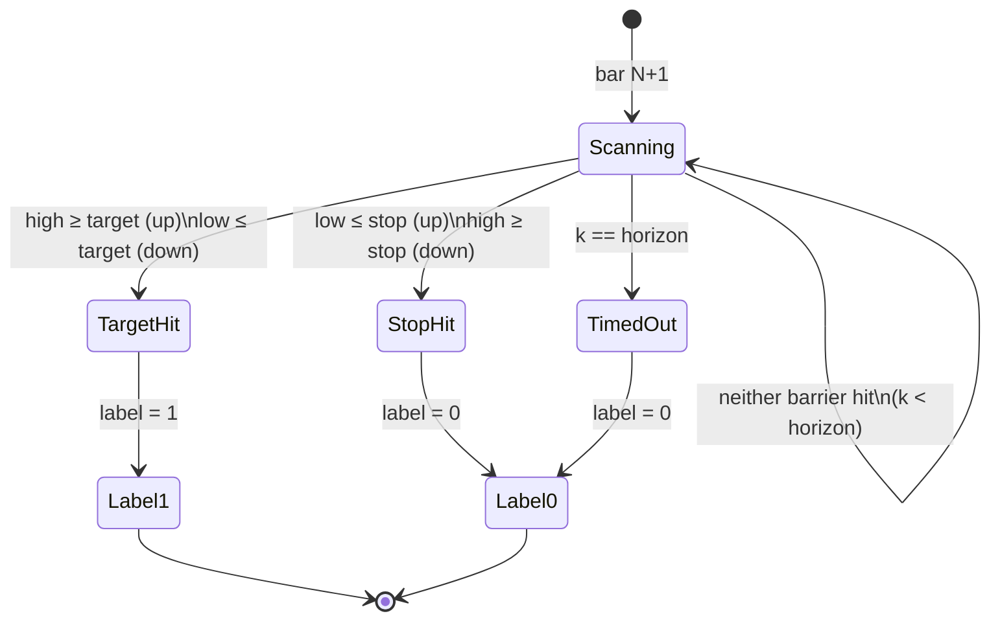
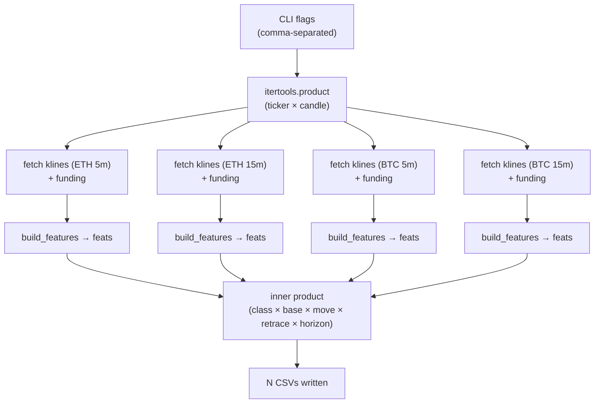
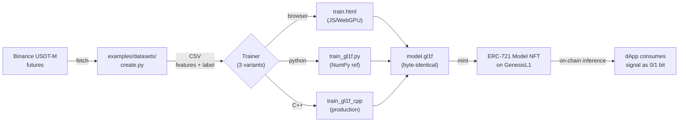

# `create.py` — GL1F Directional Dataset Builder

> Triple-barrier binary-classification datasets for on-chain GBDT inference.
> Binance USDT-M perpetual futures · strict no-leak guarantee · byte-deterministic outputs.

**Location:** [`examples/datasets/create.py`](./create.py) in the [`GenesisL1/Forest`](https://github.com/GenesisL1/Forest) repository.

---

## Fast start

Five typical invocations. Each runs from the `Forest/` repo root.

#### 1. Single dataset — the minimal run

ETH 15m up-classifier, slim 31-feature set. One CSV.

```bash
python examples/datasets/create.py \
    --ticker ETH --candle 15m --class up \
    --base ema5 --move-pct 1.5 --no-retrace 0.5 \
    --horizon 4h --start-date 01-01-2024 --small
```

#### 2. Symmetric up/down pair

One classifier per direction, ensemble at inference. Two CSVs, one Binance fetch.

```bash
python examples/datasets/create.py \
    --ticker ETH --candle 15m --class up,down \
    --base ema5 --move-pct 1.5 --no-retrace 0.5 \
    --horizon 4h --start-date 01-01-2023 --small
```

#### 3. Hyperparameter sweep

Sweep `move × retrace × horizon` to pick the best (move, retrace, horizon) by validation log-loss. 24 CSVs, one fetch.

```bash
python examples/datasets/create.py \
    --ticker ETH --candle 15m --class up \
    --base ema5 --move-pct 1.0,1.5,2.0,2.5 \
    --no-retrace 0.3,0.5,0.7 --horizon 2h,4h \
    --start-date 01-01-2023 --output-dir ./sweep --small
```

#### 4. R1 reference (log-loss 0.1254)

Exact configuration of the GL1F R1 reference model.

```bash
python examples/datasets/create.py \
    --ticker ETH --candle 15m --class up \
    --base ema5 --move-pct 2.0 --no-retrace 0.7 \
    --horizon 5h --start-date 01-01-2022 --end-date 01-01-2025 \
    --output-dir ./datasets/r1 --small
```

#### 5. Cross-ticker macro baseline

BTC + ETH + SOL on 1h candles, both directions, full ~150-column feature matrix. Six CSVs, three fetches.

```bash
python examples/datasets/create.py \
    --ticker BTC,ETH,SOL --candle 1h --class up,down \
    --base ema7 --move-pct 2.0 --no-retrace 1.0 \
    --horizon 12h --start-date 01-01-2022 \
    --output-dir ./datasets/macro_1h
```

---

## Table of contents

- [Fast start](#fast-start)
- [What this is](#what-this-is)
- [Why it exists (GL1F context)](#why-it-exists-gl1f-context)
- [Install](#install)
- [Quickstart — one command, one dataset](#quickstart--one-command-one-dataset)
- [CLI reference](#cli-reference)
- [The triple-barrier label](#the-triple-barrier-label)
- [Feature catalog](#feature-catalog)
- [`--small` mode (the R1 31-feature slim set)](#--small-mode-the-r1-31-feature-slim-set)
- [Cartesian product mode](#cartesian-product-mode)
- [No-leak contract](#no-leak-contract)
- [Output schema](#output-schema)
- [Production recipes](#production-recipes)
- [Pipeline: dataset → trainer → on-chain Model NFT](#pipeline-dataset--trainer--on-chain-model-nft)
- [Troubleshooting](#troubleshooting)
- [Reproducibility & determinism](#reproducibility--determinism)
- [FAQ](#faq)

---

## What this is

`create.py` is a single-file dataset builder that turns Binance USDT-M perpetual-futures klines into labeled training CSVs for directional binary classification. It is the canonical preprocessing stage for every GBDT model trained against GL1F's deterministic inference VM.

| | |
|---|---|
| **Input** | Binance futures klines + funding (paginated, auto-backoff) |
| **Output** | One CSV per `(ticker, candle, class, base, move, retrace, horizon)` tuple |
| **Label** | `{0, 1}` triple-barrier outcome relative to an EMA baseline |
| **Features** | Up to **~150 derived columns** — momentum, vol, microstructure, funding, calendar |
| **Slim mode** | `--small` → exactly **31 features** (R1 / GL1F production set) |
| **Guarantees** | Strict causality, post-write column-set verification, deterministic file naming |

It is intentionally boring: no notebooks, no config files, no hidden state. One script, one CLI, reproducible CSVs.

---

## Why it exists (GL1F context)

GenesisL1 is an EVM Layer-1 with an integrated GBDT model studio called **GenesisL1 Forest** (GL1F). Trained gradient-boosted trees are minted as ERC-721 **Model NFTs** on GenesisL1 and executed deterministically on-chain via integer-quantized inference. To make on-chain inference meaningful, the training data has to be:

1. **Causally clean.** A leak that wouldn't survive a backtest certainly won't survive a live oracle. Every feature at row `N` uses only data from rows `[0..N]`. Every label at row `N` uses only data from rows `[N+1..N+horizon]`.
2. **Byte-reproducible.** The same `--ticker --candle --start-date --end-date` arguments must yield the same CSV, so any reader can verify the dataset hash referenced in a Model NFT's metadata.
3. **Aligned with the inference geometry.** The triple-barrier label here matches the on-chain prediction primitive — *"will price hit `baseline · (1+move)` before `baseline · (1−retrace)` within `horizon` bars?"* — a single bit, directly consumable by smart contracts.

If you are training models that will not go on-chain, the script is still useful — but the design decisions only fully pay off when the dataset is part of an auditable model artifact.

---

## Install

```bash
git clone https://github.com/GenesisL1/Forest
cd Forest

python -m venv .venv && source .venv/bin/activate
pip install numpy pandas requests
```

No exotic dependencies. The script is intentionally tight: `numpy`, `pandas`, `requests`. That's it.

The script lives at `examples/datasets/create.py`. All examples below are run from the repo root:

```bash
python examples/datasets/create.py --help
```

> **Network requirements.** `create.py` hits `fapi.binance.com` for klines and funding-rate history. There is no API key needed (public endpoints), but Binance enforces a weight-based rate limit per IP — the script handles 418/429 with exponential backoff up to 6 retries.

---

## Quickstart — one command, one dataset

Build an ETH 15m "up" classifier asking *"will ETH break +1.5% above the EMA-5 baseline within 4 hours, without first retracing −0.5%?"* starting from January 2024:

```bash
python examples/datasets/create.py \
    --ticker     ETH \
    --candle     15m \
    --class      up \
    --base       ema5 \
    --move-pct   1.5 \
    --no-retrace 0.5 \
    --horizon    4h \
    --start-date 01-01-2024 \
    --small
```

Output file (deterministic name):

```
ETH_15m_up_ema5_move1.5_retrace0.5_horizon4h_start_01-01-2024.csv
```

Console summary at the end:

```
==============================================================================
  SUMMARY
==============================================================================
file                                                         rows   pos%   neg%  feats
------------------------------------------------------------------------------
ETH_15m_up_ema5_move1.5_retrace0.5_horizon4h_start_01-...   65,432   23.1%  76.9%   31
```

That CSV is now ready to be fed directly into `train_gl1f.py` or `train_gl1f_cpp` — see [the pipeline section](#pipeline-dataset--trainer--on-chain-model-nft).

---

## CLI reference

All of `--ticker / --candle / --class / --base / --move-pct / --no-retrace / --horizon` accept comma-separated values and produce a **Cartesian product** of output files (see [Cartesian product mode](#cartesian-product-mode)).

| Flag | Required | Accepts | Example | Notes |
|---|:---:|---|---|---|
| `--ticker` | ✓ | symbol(s), USDT quote implicit | `ETH` · `BTC,ETH,SOL` | Resolves to `{TICKER}USDT` on Binance USDT-M futures. |
| `--candle` | ✓ | `1m 3m 5m 15m 30m 1h 2h 4h 6h 8h 12h 1d` | `15m` · `5m,15m,1h` | One of the supported intervals only. |
| `--class` | ✓ | `up` · `down` (or both) | `up` · `up,down` | Direction of the target barrier. |
| `--base` | ✓ | `emaN` strings | `ema5` · `ema5,ema7,ema12` | EMA span in **bars**, `adjust=False` (causal). |
| `--move-pct` | ✓ | float(s) in **percent** | `1.5` · `1.0,1.5,2.0` | Distance from baseline to target. |
| `--no-retrace` | ✓ | float(s) in **percent** | `0.5` · `0.3,0.5,0.7` | Max counter-move (stop distance). |
| `--horizon` | ✓ | duration or bar count | `4h` · `30m,2h,4h,1d` · `43` | Duration must divide evenly into `--candle`. Bare integer = bars. |
| `--start-date` | ✓ | `DD-MM-YYYY` or `YYYY-MM-DD` | `01-01-2024` | UTC. |
| `--end-date` |   | same formats | `01-01-2025` | Default: now (truncated to the hour). |
| `--output-dir` |   | path | `./out` | Created if missing. Default `.`. |
| `--no-funding` |   | flag | — | Skip funding-rate features (one less HTTP call per ticker). |
| `--small` |   | flag | — | Emit only the 31-feature R1 slim set. **Recommended for GL1F training.** |

---

## The triple-barrier label

Every row `N` in the output gets a binary label by simulating a trade entered at row `N+1`:

```
baseline[N]   = EMA{P}(close)[N]          # causal — uses data up to N only
target[N]     = baseline[N] · (1 ± move/100)
stop[N]       = baseline[N] · (1 ∓ retrace/100)

label[N] = 1   iff some bar k ∈ [N+1 .. N+horizon] hits `target`
               BEFORE any bar in [N+1..k] hits `stop`
         = 0   otherwise (stopped out, or timed out)
```

The signs flip for `--class down`: target below baseline (tested against the bar **low**), stop above (tested against the bar **high**).

### Same-bar conflict rule

If `target` and `stop` are touched on the **same future bar**, the **stop is considered hit first** → `label = 0`. This is the conservative resolution for a long trade. It biases the classifier toward false negatives rather than false positives, which is the correct trade-off for capital deployment.

### Barrier geometry (`--class up`)

```
                        target  ──────────  baseline · (1 + move/100)
                           ▲
                           │
                           │   bars [N+1 .. N+horizon]
   close[N] ───●───────────│
                           │
                           ▼
                         stop  ──────────  baseline · (1 − retrace/100)

label[N] = 1   iff   high of some future bar k reaches `target`
                AND  low of bars 1..k never reached `stop` first
```

### State machine



### Why an EMA baseline (not `close[N]`)

Using `close[N]` directly would mean a noisy tick at row `N` defines the entry. EMA-5 (the production default) acts as a 5-bar smoothing reference, so the label is robust to single-bar wicks and instead reflects the *trend-relative* move. The `close_to_ema5` feature explicitly encodes *where current price sits relative to the entry reference* — the same coordinate system as the label.

---

## Feature catalog

`create.py` emits up to **~150 derived feature columns**, grouped below by what the feature actually *measures*. Two windowing conventions coexist throughout the catalog:

- **Hours-based** *(suffix `_Xh` or trailing `_X` referring to hours)* — window expressed in hours, converted to bars via `H(hours) = round(hours · bars_per_hour)`. On a 15m candle, `rsi_14h` is RSI(56). This convention keeps an indicator's *physical* meaning constant across candle resolutions.
- **Bar-based** *(no `h` suffix, or explicit small integer like `_12` or `100`)* — raw bar count. Used for tight, candle-local signals (`RSI14`, `volatility_5`, `body_signed_3`).

All formulas use only past + present data — see [No-leak contract](#no-leak-contract).

### 1. Returns

| Feature | Definition |
|---|---|
| `ret_{1,2,4,8,12,24,48,72,168}h` | Log return over N hours |
| `ret_1h_lag{1,2,3,4,6,12,24}` | 1-bar log return, lagged by N bars |
| `r1_log` | 1-bar log return |
| `r12_log` | 12-bar log return |
| `return_5_3` | `pct_change` over 3 bars |
| `return_60_3` | `pct_change` over 36 bars |

### 2. Momentum & rate of change

| Feature | Definition |
|---|---|
| `roc_{6,12,24,48}h` | Rate of change (pct_change) over N hours |
| `mom_5` | 5-bar rolling sum of 1-bar returns |
| `sign_persist_12` | Mean sign of last 12 bar-returns ∈ [−1, +1] — direction consistency, magnitude-blind |

### 3. Volatility

#### 3a. Realized volatility (close-to-close)

| Feature | Definition |
|---|---|
| `realized_vol_{6,12,24,48,168}h` | Std of 1-bar log returns over N hours |
| `rv_{6,24,48,168,336}h` | Same family, additional horizons (up to 336h = 2 weeks) |
| `volatility_5` | 12-bar std of 1-bar returns |
| `rv6_over_rv24` | Short vs medium realized vol — regime intensity |
| `rv_short_vs_long_504` | RV(24h) / RV(504h) |
| `rv_medium_vs_long` | RV(168h) / RV(504h) |
| `rv24_rank_{168,504}` | Fraction of past N hours where RV(24h) was below the current value |
| `vol_of_vol_{168,504}` | Std of RV(24h) over N hours |
| `rv_log_change_{12,24,72}h` | `log(RV_now / RV_{N hours ago})` |

#### 3b. OHLC volatility estimators

| Feature | Definition |
|---|---|
| `parkinson_24`, `park_{6,48,72,168}h` | Parkinson HL-range estimator |
| `gk_24`, `gk_{6,48,168}h` | Garman-Klass OHLC estimator |
| `rs_{12,48,168}h` | Rogers-Satchell drift-robust estimator |

#### 3c. ATR family

| Feature | Definition |
|---|---|
| `atr_14`, `atr_24` | EWM ATR (Wilder smoothing) over N hours |
| `atr_pct_14`, `atr_14_pct`, `atr_48_pct` | ATR / close |
| `tr_pct` | True range / close |
| `ATR_norm14` | SMA ATR (14 bars) / close |
| `ATR_ratio100` | SMA ATR (100 bars) / close |
| `ATR_HL_ratio100` | ATR(100) / 100-bar HL range |

#### 3d. Bollinger

| Feature | Definition |
|---|---|
| `bb_pctb_20h` | `(close − lower) / (upper − lower)`, 20h window, 2σ |
| `bb_width_20h` | `(upper − lower) / MA`, 20h, 2σ |
| `BollBW50` | Bollinger bandwidth, 50-bar SMA, 2σ |

#### 3e. Tail & jump risk

| Feature | Definition |
|---|---|
| `jumps_2sigma_168h` | Fraction of last 168h bars with `\|r\| > 2σ_{168h}` |
| `max_abs_ret_scaled_{24,168}h` | `max\|r\| / σ` over N hours |
| `jump_ratio_{24,72}h` | `(RV − bipower-variation) / RV` ∈ [−1, 1] — jump component of variance |
| `neg_var_{24,72}h` | Realized negative semivariance (down-only) |
| `pos_var_{24,168}h` | Realized positive semivariance (up-only) |
| `semivol_ratio_{72,168}h` | `√(neg_var / pos_var)` — downside skew of vol |

#### 3f. HL range

| Feature | Definition |
|---|---|
| `hl_range_mean_{24,168}h` | Mean `log(high/low)` over N hours |
| `hl_range_max_{72,168}h` | Max `log(high/low)` over N hours |

### 4. Oscillators

| Feature | Definition |
|---|---|
| `rsi_14h`, `rsi_24h` | Wilder/EWM RSI over N hours |
| `RSI14` | SMA-based RSI over 14 bars |
| `macd`, `macd_signal`, `macd_hist` | MACD line / signal / histogram, each normalized by close |
| `willr_{14,24}h` | Williams %R |
| `stoch_k_{14,24}h` | Stochastic %K |
| `cci_20h` | Commodity Channel Index, 20h |
| `mfi_14h` | Money Flow Index, 14h |
| `adx_14h` | Average Directional Index, 14h |

### 5. Trend & regime

| Feature | Definition |
|---|---|
| `ema_ratio_{9,21,50,100,200}h` | `close / EMA(N hours) − 1` |
| `close_to_ema5` | `close / EMA(5 bars) − 1` — **same coordinate system as the triple-barrier baseline** |
| `TrendConsist100` | Std of segment-mean diffs over 100 bars in 10-bar segments |
| `BW_CHOP100` | Bollinger BW(20) / CHOP(100) — trend vs chop ratio |
| `trend_r2_12` | R² of close vs time over 12 bars — momentum-regime detector |
| `ret_skew_24h` | Skewness of 1-bar returns over 24h — distinguishes trend from chop-with-bias |

### 6. Position relative to reference

| Feature | Definition |
|---|---|
| `dist_high_{24,72,168}h` | `close / rolling_max(high) − 1` |
| `dist_low_{24,72,168}h` | `close / rolling_min(low) − 1` |
| `vwap_dev_{24,72}h` | `close / rolling VWAP − 1` |
| `dist_high24_atr` | `(close − 24h max high) / ATR(14)` — breakout proxy |
| `dist_low24_atr` | `(close − 24h min low) / ATR(14)` — breakdown proxy |
| `dist_ema5_atr` | `(close − EMA5) / ATR(14)` — signed distance to baseline in ATR units |

### 7. Volume & order flow

| Feature | Definition |
|---|---|
| `log_volume` | `log1p(volume)` |
| `vol_z_{24,168}` | Z-score of volume over N hours, clipped to ±10 |
| `vol_ma_ratio_24h` | volume / 24h rolling mean |
| `volume_surge_3` | volume / 6h rolling mean — flow-surge / cascade proxy |
| `taker_buy_ratio` | `taker_buy_base / volume` |
| `taker_imbalance` | `(2·taker_buy_base − volume) / volume` ∈ [−1, 1] |
| `taker_imbalance_ma_{6,24}h` | Rolling mean of taker imbalance |
| `taker_imbalance_abs_ma_24h` | Rolling mean of `\|taker imbalance\|` — flow intensity |
| `taker_imb_sum_6` | 6h rolling sum of taker imbalance — net buy/sell pressure |
| `obv` | On-balance volume (cumulative signed volume) |
| `obv_z_168h` | Z-score of OBV over 168h |
| `log_trades` | `log1p(trade_count)` |
| `avg_trade_size` | volume / trade count, clipped to `[0, 1e6]` |

### 8. Candle microstructure

| Feature | Definition |
|---|---|
| `body_ratio` | `(close − open) / (high − low)` — signed body fraction |
| `body_range_ratio` | `\|close − open\| / (high − low)` — unsigned body fraction |
| `upper_wick` | `(high − max(close, open)) / (high − low)` |
| `lower_wick` | `(min(close, open) − low) / (high − low)` |
| `body_signed_3` | 3-bar mean of signed body fraction |
| `wick_imbalance_3` | 3-bar mean of (lower wick − upper wick) — positive = dip-buying |
| `range_efficiency_6` | 6-bar mean of `\|close − open\| / (high − low)` — clean directional bar vs doji |
| `gap_open` | `log(open / prev_close)` |

### 9. Funding *(skipped if `--no-funding`)*

| Feature | Definition |
|---|---|
| `funding_rate` | Most recent funding rate, forward-filled to each bar |
| `funding_rate_ma_{24,72}h` | Rolling means |
| `funding_rate_change` | First difference |
| `funding_cum_24h` | 24h rolling sum |
| `funding_positive_frac_168h` | Fraction of last 168h bars where rate > 0 |

### 10. Calendar

| Feature | Definition |
|---|---|
| `hour_sin`, `hour_cos` | Cyclical sin/cos of UTC hour |
| `dow_sin`, `dow_cos` | Cyclical sin/cos of day-of-week |
| `is_weekend` | Saturday/Sunday flag |
| `is_friday` | Friday flag |
| `hour`, `dow` | Integer hour and day-of-week |

---

## `--small` mode (the R1 31-feature slim set)

For GL1F production models, the full ~150-column matrix is overkill. The `--small` flag emits exactly the 31 features used in the R1 reference model (ETH 15m, `move=2.0`, `no-retrace=0.7`, `horizon=5h`, test log-loss = **0.1254**):

<details>
<summary><b>Click to see the full 31-feature list</b></summary>

```text
# core 20 — returns, oscillator, vol, microstructure, calendar, funding, baseline
r1_log, r12_log
RSI14, ATR_norm14, body_range_ratio
ATR_ratio100, BollBW50, BW_CHOP100, ATR_HL_ratio100, TrendConsist100
return_5_3, return_60_3
volatility_5, mom_5
hour, dow
funding_rate, funding_rate_ma_24h, funding_cum_24h
close_to_ema5

# label-aligned 11 — barrier-relative position, bar rejection, flow surges, regime
dist_ema5_atr, rv6_over_rv24
body_signed_3, wick_imbalance_3
volume_surge_3, taker_imb_sum_6
ret_skew_24h, sign_persist_12
range_efficiency_6
trend_r2_12
dist_high24_atr, dist_low24_atr
```

</details>

Slim mode is the default for any model destined for on-chain inference — smaller feature count means smaller Model NFT, fewer integer-quantization rounding paths, and lower inference gas.

> ⚠️ **Caveat.** `--small` requires funding features. If you also pass `--no-funding`, the script will exit with a clear error.

---

## Cartesian product mode

The killer feature for hyperparameter sweeps: every multi-value flag expands into a product. Klines and features are fetched and computed **once per `(ticker, candle)` pair**, then every label combination is applied to the cached feature matrix.

```bash
python examples/datasets/create.py \
    --ticker     ETH,BTC \
    --candle     5m,15m \
    --class      up,down \
    --base       ema5,ema7 \
    --move-pct   1.0,1.5,2.0 \
    --no-retrace 0.5,0.7 \
    --horizon    2h,4h \
    --start-date 01-01-2024 \
    --output-dir ./sweep \
    --small
```

Result: **2 × 2 × 2 × 2 × 3 × 2 × 2 = 192 CSVs** in `./sweep/`, but only **4 Binance fetches** (one per `(ticker, candle)` pair). The console prints a summary table at the end with rows, positive-class %, and feature count per file.

```
ETH_5m_up_ema5_move1.0_retrace0.5_horizon2h_start_01-01-2024.csv     ...
ETH_5m_up_ema5_move1.0_retrace0.5_horizon4h_start_01-01-2024.csv     ...
ETH_5m_up_ema5_move1.0_retrace0.7_horizon2h_start_01-01-2024.csv     ...
...
BTC_15m_down_ema7_move2.0_retrace0.7_horizon4h_start_01-01-2024.csv  ...
```

### Execution graph



---

## No-leak contract

The most expensive bug in financial ML is a future-information leak. This script enforces causality at five levels:

| Layer | Guard |
|---|---|
| **Feature math** | Every rolling / ewm operation uses `adjust=False` (causal recursion) or strict left-aligned windows. No future shifts, ever. |
| **Label window** | `label[N]` reads `klines.high[N+1 .. N+horizon]` and `klines.low[N+1 .. N+horizon]` only. Same-bar ambiguity resolves to the stop. |
| **Warmup trim** | Rows before `--start-date` are kept during feature computation (warmup), then dropped. Rows with any NaN feature are dropped. |
| **Forward-window trim** | Rows where `N + horizon ≥ len(df)` are labeled `-1` and dropped before save. |
| **Post-write verification** | After `to_csv`, the file is re-opened with `nrows=0` and the column set is checked. Any leaked OHLCV column raises `RuntimeError`. |

The raw OHLCV columns (`open`, `high`, `low`, `close`, `volume`, `taker_buy_*`, …) and the EMA baseline itself are **never written to the output CSV**. The label is computed from the raw kline frame held in memory; the saved features go through a separate `forbidden` column intersection check before write.

### Information boundary

```
              ─────────  PAST + PRESENT (allowed)  ─────────┃───  FUTURE (label only)  ───
                                                            ┃
  row index:           …  N−3   N−2   N−1    N              ┃   N+1   N+2   …   N+horizon
                                                            ┃
  features[N]  uses:   ✓     ✓     ✓     ✓     ✓            ┃    ✗     ✗            ✗
  baseline[N]  uses:   ✓     ✓     ✓     ✓     ✓            ┃    ✗     ✗            ✗
  label[N]     uses:   ✗     ✗     ✗     ✗     ✗            ┃    ✓     ✓            ✓
                                                            ┃
                                                      row-N boundary
```

---

## Output schema

A row in the resulting CSV looks like this (showing slim mode — full mode adds ~120 more columns between `close_to_ema5` and `label`):

| `open_time` (UTC) | `r1_log` | `r12_log` | `RSI14` | … | `dist_low24_atr` | `label` |
|---|---|---|---|---|---|---|
| `2024-01-01 00:00:00+00:00` | -0.00124 | 0.00891 | 56.12 | … | -0.342 | `1` |
| `2024-01-01 00:15:00+00:00` |  0.00207 | 0.01098 | 58.34 | … | -0.218 | `0` |
| `2024-01-01 00:30:00+00:00` | -0.00056 | 0.00942 | 57.21 | … | -0.297 | `0` |
| … | … | … | … | … | … | … |

- **Index:** `open_time` (ISO UTC).
- **Columns:** derived features only + `label` ∈ `{0, 1}`. Float columns serialized with `%.8g` for compactness without precision loss.
- **No header trickery.** First row is column names. No multi-index, no metadata block.

### Filename grammar

```
{TICKER}_{candle}_{class}_{base}_move{move}_retrace{retrace}_horizon{horizon}_start_{start-date}.csv
  │        │       │       │         │              │                │              │
  │        │       │       │         │              │                │              └─ raw --start-date string
  │        │       │       │         │              │                └─ raw --horizon string ("4h", "30m", "43")
  │        │       │       │         │              └─ raw --no-retrace string
  │        │       │       │         └─ raw --move-pct string
  │        │       │       └─ raw --base string (e.g. "ema5")
  │        │       └─ "up" | "down"
  │        └─ raw --candle string ("15m", "1h", …)
  └─ raw --ticker uppercased
```

---

## Production recipes

These are real recipes drawn from the GL1F R1 training pipeline. All paste-runnable from the repo root.

### R1 reference: ETH 15m up classifier

The exact configuration that produced the **log-loss 0.1254** model referenced in the GL1F paper:

```bash
python examples/datasets/create.py \
    --ticker     ETH \
    --candle     15m \
    --class      up \
    --base       ema5 \
    --move-pct   2.0 \
    --no-retrace 0.7 \
    --horizon    5h \
    --start-date 01-01-2022 \
    --end-date   01-01-2025 \
    --output-dir ./datasets/r1 \
    --small
```

### Symmetric up/down pair for a directional ensemble

Train one classifier for each direction; aggregate at inference time. The triple-barrier definition is symmetric, so the two CSVs are directly comparable.

```bash
python examples/datasets/create.py \
    --ticker     ETH \
    --candle     15m \
    --class      up,down \
    --base       ema5 \
    --move-pct   1.5 \
    --no-retrace 0.5 \
    --horizon    4h \
    --start-date 01-01-2023 \
    --output-dir ./datasets/eth_15m_pair \
    --small
```

### Hyperparameter sweep — picking the optimal `(move, retrace, horizon)` triplet

Run once, train 24 models in parallel downstream, pick the best by validation log-loss.

```bash
python examples/datasets/create.py \
    --ticker     ETH \
    --candle     15m \
    --class      up \
    --base       ema5 \
    --move-pct   1.0,1.5,2.0,2.5 \
    --no-retrace 0.3,0.5,0.7 \
    --horizon    2h,4h \
    --start-date 01-01-2023 \
    --output-dir ./sweep/eth_15m_up \
    --small
```

→ 24 CSVs, 1 fetch.

### Cross-ticker baseline (BTC + ETH + SOL, 1h candles)

For a more macro signal where 15m noise hurts:

```bash
python examples/datasets/create.py \
    --ticker     BTC,ETH,SOL \
    --candle     1h \
    --class      up,down \
    --base       ema7 \
    --move-pct   2.0 \
    --no-retrace 1.0 \
    --horizon    12h \
    --start-date 01-01-2022 \
    --output-dir ./datasets/macro_1h
```

(Note: no `--small` here, so you get the full ~150-column matrix — useful for feature-importance analysis before slimming.)

### Lean mode — no funding (private exchanges, smaller payload)

If the model will be served on a venue without persistent funding-rate data, drop those columns up front.

```bash
python examples/datasets/create.py \
    --ticker     BTC \
    --candle     1h \
    --class      up \
    --base       ema5 \
    --move-pct   1.5 \
    --no-retrace 0.5 \
    --horizon    6h \
    --start-date 01-01-2023 \
    --no-funding
```

> Reminder: `--small` and `--no-funding` are mutually exclusive in practice — the R1 slim set includes 3 funding features.

---

## Pipeline: dataset → trainer → on-chain Model NFT

The CSV produced here is the input to all three reference GL1F trainers, which produce byte-identical `.gl1f` model files:



The `modelId` minted on-chain is a hash that includes the dataset hash — making the CSV produced by `create.py` an end-to-end training witness. Anyone can re-run this script with the same arguments, hash the output, and verify it matches the dataset hash baked into a Model NFT's metadata.

---

## Troubleshooting

| Symptom | Likely cause | Fix |
|---|---|---|
| `--small: feature(s) not produced by build_features: ['funding_rate', ...]` | You combined `--small` with `--no-funding`. The slim set requires funding. | Drop `--no-funding` *or* drop `--small`. |
| `horizon '7m' is not an integer multiple of candle '15m'` | Horizon must divide evenly into the candle size. | Round to the nearest multiple, e.g. `--horizon 15m` or `30m`. |
| `rate-limited (429); sleeping 4s` | Binance IP rate limit. The script backs off automatically. | Wait it out; up to 6 retries with exponential backoff. |
| `output CSV has forbidden columns: ['close']` | A code change accidentally let raw OHLCV into the feature dict. | This is a **hard guard** — fix the feature builder; don't bypass it. |
| Resulting CSV has very few rows | Long `--horizon` + recent `--end-date` ⇒ many rows dropped for lacking a full forward window. | Pull `--end-date` further into the past, or shorten the horizon. |
| `pos%` near 0 or 100 | `--move-pct` is mis-scaled vs the asset's vol (too tight or too generous). | Tune `--move-pct` to roughly the typical N-bar realized range. Most balanced datasets land between 15% and 45% positives. |
| `connection refused` / `timeout` | Binance briefly unreachable, or you're behind a regional block. | Use a VPN, or wait. The script retries 6 times. |

---

## Reproducibility & determinism

`create.py` is engineered for bit-level reproducibility with one explicit caveat:

✅ **Deterministic between runs**
- Feature math (closed-form pandas/numpy operations).
- Label computation (vectorized, no random sampling).
- File naming and column ordering (insertion order, preserved by Python dicts).
- CSV float serialization (`%.8g`).

⚠️ **Not byte-identical across runs in rare cases**
- Binance occasionally back-fills late-arriving funding events. If you re-fetch a window 6 months later, you might get one more funding entry than before. To freeze: pass `--end-date` and cache the raw klines/funding JSON externally.

The intended workflow for a Model NFT release:

```bash
# 1. Build dataset, deterministic by --end-date
python examples/datasets/create.py ... --end-date 01-01-2025 --output-dir release/

# 2. Hash it
sha256sum release/*.csv > release/MANIFEST.sha256

# 3. Reference the hash in the Model NFT metadata
```

---

## FAQ

**Q: Why hours-based and bar-based windows side-by-side?**
Two reasons. Hours-based features (`rsi_14h`, `realized_vol_24h`, etc.) keep an indicator's physical meaning constant across candle resolutions — RSI of "14 hours" means the same thing whether the candle is 15m or 1h. Bar-based features (`RSI14`, `volatility_5`, `body_signed_3`) are tight, candle-local signals that operate in the candle's native time scale. Both are useful, and the trainer picks whichever subset works for the model's horizon.

**Q: Why EMA-5 specifically for the baseline?**
Short enough to be responsive to the most recent bar, long enough to filter single-bar wicks. Other EMAs are available via `--base` (`ema7`, `ema12`, …) — empirically EMA-5 has been the best for 15m models, EMA-7 sometimes wins for 1h.

**Q: Can I add my own features?**
Yes. Append them to `build_features` and they'll appear in the output CSV automatically. To use them with `--small`, add their names to `SMALL_FEATURE_LIST`. The hard column-set guard at the bottom of `write_dataset` will catch any accidental OHLCV leakage.

**Q: Why no `--seed`?**
Nothing in the script is stochastic. There is no randomness to seed.

**Q: Why USDT-M perpetuals and not spot?**
Funding rate. Spot doesn't have it, and funding has consistently been one of the higher-value features in directional models. If you need spot, swap `BASE_URL` and `/fapi/` → `/api/`, and drop the funding fetcher.

**Q: What about regime drift / non-stationarity?**
Out of scope for this script — but cleanly handled by training one model per regime window and ensembling at inference time. The `--start-date` / `--end-date` flags make rolling-window dataset generation trivial.

---

`create.py` is part of the [`GenesisL1/Forest`](https://github.com/GenesisL1/Forest) reference toolchain for [GL1F](https://gl1f.com).
For the on-chain inference VM and Model NFT spec, see the [GL1F whitepaper](https://gl1f.com/paper).
